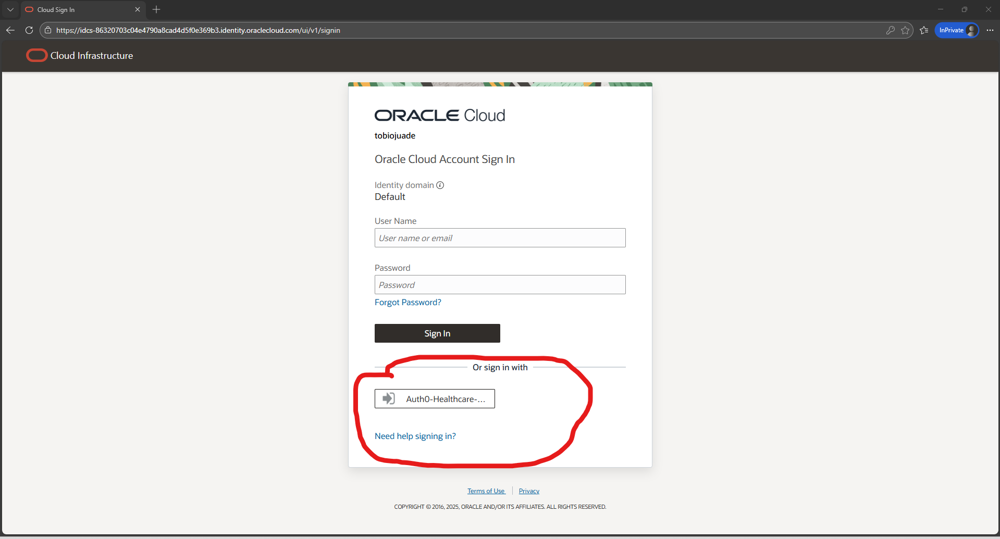
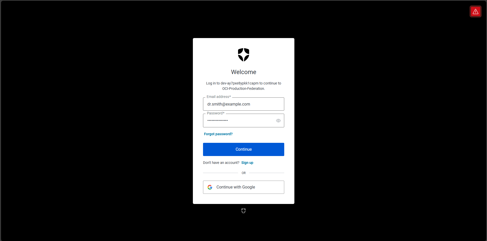
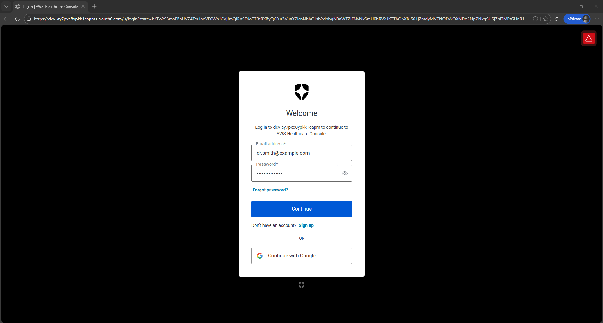

# Multi-Cloud Identity Federation: AWS & OCI with Auth0

**Enterprise Identity-as-a-Service (IDaaS) Implementation**

[](https://www.oracle.com/cloud/)
[](https://aws.amazon.com/)
[](https://auth0.com/)
[](https://www.terraform.io/)

---

## 📌 Project Overview

This project demonstrates a **production-ready Single Sign-On (SSO) architecture** that federates a single identity across **Amazon Web Services (AWS)** and **Oracle Cloud Infrastructure (OCI)** using **Auth0** as the central Identity Provider.

**The Challenge:** Healthcare organizations like Ascension are migrating to OCI while maintaining existing AWS workloads. Staff need seamless access to both clouds without managing multiple credentials.

**The Solution:** By implementing **SAML 2.0 federation** with Auth0 as the identity hub, I created a "Zero Trust" architecture where users authenticate once and access resources across clouds with role-based, least-privilege permissions.

**Real-World Impact:**
- 🔐 **Single identity** (Dr. Smith) → Access to both AWS and OCI
- 🎯 **Least Privilege** → Read-only S3 in AWS, clinical compartment in OCI
- 📊 **Centralized audit trail** → All authentication flows through Auth0
- ⚡ **Reduced attack surface** → One set of credentials to secure
- 🏥 **HIPAA-aligned** → PHI data isolation via compartmentalization

---

## 🏗️ Architecture

```
┌─────────────────────────────────────────────────────────┐
│               Dr. Smith (Healthcare User)               │
└─────────────────────────────────────────────────────────┘
                         ↓
                   Single Login
                         ↓
┌─────────────────────────────────────────────────────────┐
│              Auth0 (Identity Provider)                  │
│                                                          │
│  • SAML 2.0 Assertions                                  │
│  • Custom JavaScript Actions                            │
│  • Attribute Mapping                                    │
│  • Multi-Cloud Token Generation                         │
└─────────────────────────────────────────────────────────┘
                         ↓
              SAML Federation (Split)
                         ↓
        ┌────────────────┴────────────────┐
        ↓                                  ↓
┌─────────────────┐              ┌─────────────────┐
│   Oracle Cloud  │              │  Amazon AWS     │
│  Infrastructure │              │                 │
├─────────────────┤              ├─────────────────┤
│ • Identity      │              │ • SAML Provider │
│   Domain        │              │ • Role: Auth0-  │
│ • Compartment:  │              │   Physician     │
│   Clinical_     │              │ • Policy: S3    │
│   Records       │              │   ReadOnly      │
│ • Group:        │              │                 │
│   Physician     │              │                 │
│ • Policy:       │              │                 │
│   Read All      │              │                 │
└─────────────────┘              └─────────────────┘
```

---

## 🛠️ Technology Stack

| Component | Technology | Purpose |
|-----------|-----------|---------|
| **Identity Hub** | Auth0 | Central SAML 2.0 Identity Provider |
| **Cloud Platforms** | OCI + AWS | Multi-cloud service providers |
| **Automation** | Terraform | Infrastructure-as-Code for OCI |
| **Security** | SAML 2.0, IAM Policies | Federation protocol & access control |
| **Language** | JavaScript (Auth0 Actions) | Dynamic SAML assertion manipulation |

---

## 🏗️ Phase 1: OCI Foundation & Automation

**Objective:** Establish secure, reproducible OCI infrastructure using Infrastructure-as-Code.

### 1.1 Local Development Setup

**OCI CLI Configuration:**
```bash
oci setup config
# Configured API signing keys for secure authentication
# Established trust between local machine and OCI tenancy
```

### 1.2 Terraform Infrastructure Deployment

**Challenge:** Initial deployment failed due to conflicting provider configurations across multiple files.

**Solution:** Consolidated all Terraform logic into a unified `main.tf` to eliminate configuration drift and ensure atomic deployments.

**Resources Provisioned:**
```hcl
# Identity Domain
resource "oci_identity_domain" "healthcare_identity" {
  display_name = "Healthcare-Identity-Domain"
  description  = "Central identity domain for healthcare federation"
}

# Clinical Compartment (PHI Data Isolation)
resource "oci_identity_compartment" "clinical_records" {
  name        = "Clinical_Records_Compartment"
  description = "Isolated compartment for Protected Health Information"
}

# Physician Group
resource "oci_identity_group" "physicians" {
  name        = "Physician_Group"
  description = "Healthcare providers with clinical data access"
}

# Least Privilege Policy
resource "oci_identity_policy" "physician_read_policy" {
  name           = "Physician-Read-Policy"
  description    = "Grant read-only access to clinical compartment"
  compartment_id = var.compartment_id
  
  statements = [
    "Allow group Physician_Group to read all-resources in compartment Clinical_Records_Compartment"
  ]
}
```

**Key Security Decision:** Physicians get **read-only** access to clinical data, preventing accidental or malicious data modification.

---

## ☁️ Phase 2: AWS Security Hardening

**Objective:** Configure AWS to accept federated identities from Auth0 while maintaining Free Tier compliance.

### 2.1 SAML Identity Provider Configuration

**Manual Configuration (AWS Console):**
1. Downloaded Auth0 SAML metadata XML
2. Created SAML Identity Provider in AWS IAM
3. Configured trust relationship for `urn:amazon:webservices`

### 2.2 IAM Role Creation

**The Trust Relationship Challenge:**

Initial configuration failed with `SAML:aud` mismatch error. Auth0 was sending the global sign-in URL, but AWS expected the specific account URL.

**Solution:** Manually edited the Trust Policy JSON:

```json
{
  "Version": "2012-10-17",
  "Statement": [
    {
      "Effect": "Allow",
      "Principal": {
        "Federated": "arn:aws:iam::XXXX:saml-provider/Auth0"
      },
      "Action": "sts:AssumeRoleWithSAML",
      "Condition": {
        "StringEquals": {
          "SAML:aud": "https://signin.aws.amazon.com/saml"
        }
      }
    }
  ]
}
```

### 2.3 Least Privilege Policy Attachment

**Role:** `Auth0-Physician-Role`  
**Policy:** `AmazonS3ReadOnlyAccess` (AWS managed policy)

**Why S3 Read-Only?** Simulates a clinical scenario where physicians can view medical imaging files (DICOM, X-rays) stored in S3 but cannot delete or modify them.

**Verification:**
```bash
# Dr. Smith can:
aws s3 ls s3://clinical-records-bucket/

# Dr. Smith CANNOT:
aws s3 rm s3://clinical-records-bucket/file.dcm
# Result: Access Denied ✓
```

---

## ⚡ Phase 3: Auth0 Identity Bridge

**Objective:** Configure Auth0 to translate a single login into cloud-specific SAML assertions for both AWS and OCI.

### 3.1 SAML Application Configuration

**OCI Application:**
- **Protocol:** SAML 2.0
- **NameID Format:** `urn:oasis:names:tc:SAML:1.1:nameid-format:emailAddress`
- **Audience:** `https://idcs-{domain-id}.identity.oraclecloud.com:443/fed`
- **Attribute Mapping:**
  ```json
  {
    "email": "http://schemas.xmlsoap.org/ws/2005/05/identity/claims/emailaddress"
  }
  ```

**AWS Application:**
- **Protocol:** SAML 2.0
- **Audience:** `https://signin.aws.amazon.com/saml`
- **ACS URL:** `https://signin.aws.amazon.com/saml`

### 3.2 Custom JavaScript Action (Critical Implementation)

**Challenge:** AWS SAML requires dynamic injection of Role ARN and Provider ARN into each assertion.

**Solution:** Created Auth0 Post-Login Action to programmatically build the SAML attribute:

```javascript
exports.onExecutePostLogin = async (event, api) => {
  const awsRoleArn = "arn:aws:iam::XXXX:role/Auth0-Physician-Role";
  const awsProviderArn = "arn:aws:iam::XXXX:saml-provider/Auth0";
  
  if (event.client.name === "AWS-Federation") {
    api.samlResponse.setAttribute(
      'https://aws.amazon.com/SAML/Attributes/Role',
      `${awsRoleArn},${awsProviderArn}`
    );
  }
};
```

**Impact:** This eliminates manual role selection during AWS login, providing seamless SSO.

---

## ✅ Verification & Testing

### Test Scenario: Dr. Smith Clinical Workflow

**1. Identity Consistency**
- ✅ Single user: `dr.smith@example.com` in Auth0
- ✅ Email verified and MFA enabled

**2. OCI Access Test**
```bash
# Login via Auth0 → OCI Identity Domain
# Result: Successfully authenticated
# User: dr.smith
# Job Title: Chief of Cardiology - Cardiology
# Access: Clinical_Records_Compartment (Read Only)
```


*OCI login page showing Auth0 federation option*


*Dr. Smith authenticated via Auth0 in OCI Console*

**3. AWS Access Test**
```bash
# Login via Auth0 → AWS Console
# Role Assumed: Auth0-Physician-Role
# Permissions: S3 Read-Only
# Test Command: aws s3 ls
# Result: Success ✓

# Test Write Attempt: aws s3 cp test.txt s3://bucket/
# Result: Access Denied ✓ (Least Privilege Working)
```


*Dr. Smith authenticated via Auth0 in AWS Console*

**4. SAML Token Debugging**
Used Auth0's SAML debugger to verify assertion contents:
- ✅ AWS: Contains correct Role ARN
- ✅ OCI: Contains email as NameID
- ✅ Both: Valid digital signatures

**5. Cross-Cloud Audit Trail**
- Auth0 logs show all authentication attempts
- OCI audit logs capture federated user actions
- AWS CloudTrail records AssumeRoleWithSAML events

---

## 📊 Project Metrics

- **Clouds Federated:** 2 (AWS + OCI)
- **Identity Sources:** 1 (Auth0)
- **SAML Providers Configured:** 2
- **Lines of Terraform:** ~150
- **Lines of JavaScript:** ~25 (Auth0 Actions)
- **IAM Policies Created:** ( OCI, AWS)
- **Security Principle:** Zero Trust + Least Privilege
- **Authentication Protocol:** SAML 2.0
---

## 🎯 Why This Matters for Healthcare

### Real-World Application: Ascension Use Case

Ascension is migrating from Cerner to Oracle Health on OCI while maintaining AWS workloads. This architecture demonstrates:

1. **Single Sign-On:** Clinical staff authenticate once, access both clouds
2. **PHI Protection:** Compartmentalization isolates Protected Health Information
3. **Compliance Ready:** Audit trails meet HIPAA requirements
4. **Reduced Risk:** Fewer passwords = smaller attack surface
5. **Cost Efficiency:** Leverage existing Auth0 investment across clouds

### Security Benefits

- **Zero Trust:** Never trust, always verify via SAML
- **Least Privilege:** Users get minimum necessary access
- **Centralized Control:** Disable one Auth0 account = revoke all cloud access
- **Auditability:** Complete login/access trail for compliance
- **MFA Enforcement:** Auth0 requires multi-factor authentication

---

## 🔐 Security Considerations

**What I Implemented:**
- ✅ SAML signature validation
- ✅ Encrypted SAML assertions (TLS)
- ✅ Role-based access control (RBAC)
- ✅ Compartment isolation (OCI)
- ✅ MFA enforcement (Auth0)
- ✅ Audit logging (all platforms)

**Production Enhancements (Not Implemented):**
- Certificate rotation automation
- Session timeout policies
- Conditional access based on location/device
- Integration with SIEM for real-time monitoring

---

## 📚 Lessons Learned

### Technical Challenges & Solutions

**1. OCI Correlation Policy**
- **Problem:** "No user returned via correlation policy" error
- **Cause:** OCI couldn't match SAML NameID to existing user
- **Solution:** Configured correlation to match email attribute and verified JSON mappings in Auth0

**2. AWS Trust Relationship**
- **Problem:** SAML:aud mismatch between Auth0 and AWS
- **Cause:** Auth0 sent global signin URL, AWS expected account-specific
- **Solution:** Modified trust policy JSON to accept global signin URL

**3. Terraform Provider Conflicts**
- **Problem:** Multiple provider blocks caused authentication conflicts
- **Cause:** Redundant provider definitions across files
- **Solution:** Consolidated into single main.tf with unified provider config

### Key Takeaways

1. **Read the Error Messages:** Most federation issues are in the SAML assertion attributes
2. **Test Incrementally:** Verify each component before moving to next phase
3. **Document Everything:** Screenshots of working configs are invaluable for troubleshooting
4. **Understand the Protocol:** SAML 2.0 has specific expectations - meet them exactly

---

## 📁 Project Structure

```
oci-aws-federated-healthcare-IAM-project/
├── terraform/
│   ├── main.tf                    # Unified Terraform configuration
│   ├── terraform.lock.hcl
│   ├── terraform.tfstate
│   └── terraform.tfvars
├── proof-of-concept/
│   ├── auth0-multi-cloud-bridge/  # Auth0 configuration screenshots
│   ├── automated-oci-foundation/  # OCI Terraform deployment
│   ├── manual-aws-configuration/  # AWS SAML setup
│   ├── oci-infra-post-terraform/  # Post-deployment configs
│   └── results/                   # Success verification screenshots
├── bulk_onboard.py                # Automated user provisioning script
├── config                         # OCI CLI configuration
└── README.md                      # This file
```

---

## 🚀 Future Enhancements

- [ ] **Automated Terraform for AWS:** Currently manual, could be IaC
- [ ] **Group-Based Provisioning:** Map Auth0 groups to cloud roles automatically
- [ ] **Multi-Region Deployment:** Replicate across OCI regions for HA
- [ ] **CI/CD Pipeline:** GitHub Actions to auto-deploy Terraform changes
- [ ] **Monitoring Dashboard:** Grafana + Prometheus for SSO metrics
- [ ] **Integration with HR System:** Auto-provision/deprovision based on employee status

---

## 🎓 Skills Demonstrated

- ✅ **Multi-Cloud Architecture:** AWS + OCI integration
- ✅ **Identity Federation:** SAML 2.0 protocol implementation
- ✅ **Infrastructure-as-Code:** Terraform automation
- ✅ **Security Best Practices:** Zero Trust, Least Privilege
- ✅ **Troubleshooting:** SAML debugging, policy resolution
- ✅ **Scripting:** JavaScript (Auth0 Actions), Python (automation)
- ✅ **Healthcare IT:** HIPAA-aligned architecture
- ✅ **Documentation:** Comprehensive technical writing

---

## 🤝 Connect

**Oluwatobi Ojuade**
- Portfolio: [ojuaos23.github.io](https://ojuaos23.github.io)
- GitHub: [@Ojuaos23](https://github.com/Ojuaos23)
- LinkedIn: [oluwatobi-ojuade](https://linkedin.com/in/oluwatobi-ojuade-9709ab343)
- Email: Tobi_Ojuade@yahoo.com

**Certifications:**
- Oracle Cloud Infrastructure 2025 Multicloud Architect Professional
- Oracle Cloud Infrastructure 2025 Architect Associate  
- Oracle Cloud Infrastructure 2025 Foundations Associate

---

**Built with ❤️ for the healthcare IT community**

*Making multi-cloud identity management secure, practical, and HIPAA-compliant.*
